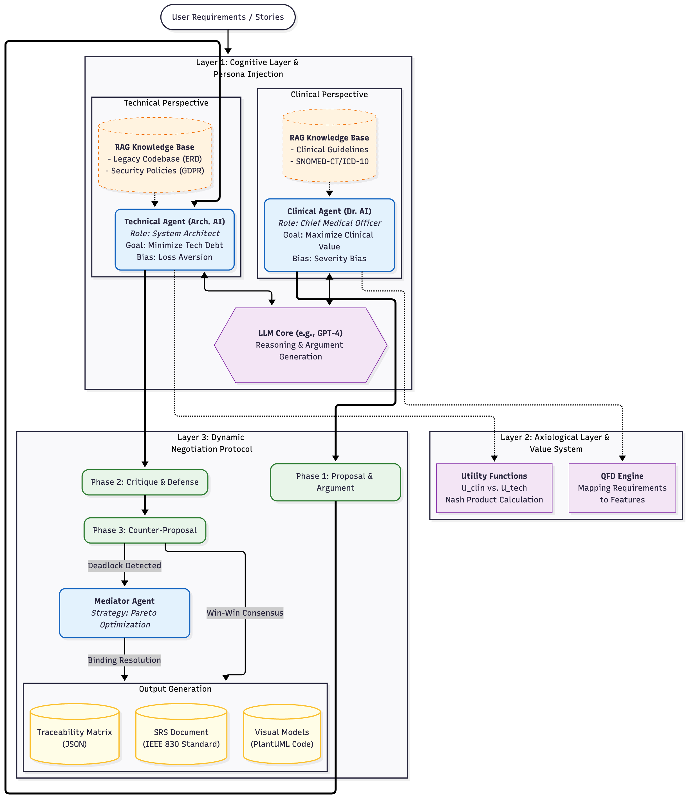

# **MedNegotiator: Agent-Based Requirements Engineering Framework**

**MedNegotiator** is a multi-agent framework designed to automate the negotiation of conflicting requirements in healthcare software projects. By leveraging Large Language Models (LLMs) and Game Theory (Nash Bargaining Solution), it simulates realistic interactions between clinical and technical stakeholders to reach Pareto-optimal agreements.

**Note:** This repository contains the reference implementation for the published paper: *"MedNegotiator: Automating requirements negotiation in healthcare by simulating clinical and technical perspectives using generative AI agents"*.

## **📚 Reference**

Published article on ScienceDirect:  
*MedNegotiator: Automating requirements negotiation in healthcare by simulating clinical and technical perspectives using generative AI agents*  
https://www.sciencedirect.com/science/article/pii/S2590005626001062

## **📖 BibTeX**

```bibtex
@article{tanhaei2026mednegotiator,
  title     = {MedNegotiator: Automating requirements negotiation in healthcare by simulating clinical and technical perspectives using generative AI agents},
  author    = {Tanhaei, Mohammad},
  journal   = {Array},
  year      = {2026},
  publisher = {Elsevier},
  pii       = {S2590005626001062},
  url       = {https://www.sciencedirect.com/science/article/pii/S2590005626001062}
}
```

A standalone BibTeX file is also included as `CITATION.bib`.

## **🏗️ Architecture**

The system operates on a three-layered architecture:



1. **Cognitive Layer:** Agents (Clinical & Technical) powered by LLMs with injected personas (Severity Bias vs. Loss Aversion).  
2. **Axiological Layer:** A QFD-based engine that calculates Utility Scores ($U_{clin}$, $U_{tech}$) for every proposal.  
3. **Communication Layer:** Implements an *Alternating Offers Protocol* with a Mediator for deadlock resolution.

## **🚀 Installation**

1. Clone the repository:  
```bash
git clone https://github.com/yourusername/MedNegotiator.git
cd MedNegotiator
```

2. Install dependencies:  
```bash
pip install -r requirements.txt
```

3. Set up your environment:  
   * Rename `.env.example` to `.env`  
   * Add your OpenAI API Key (or other LLM provider key).

## **🏃 Usage**

To run the "WSI Storage Conflict" case study (as described in the paper):

```bash
python main.py
```

### **Example Output**

```text
[Round 1] Clinical Agent (Dr. Onc): I propose storing raw WSI files for AI research...
[System] Technical Utility: 0.12 (REJECTED)
[Round 1] Technical Agent (Arch. Sys): Rejected. Cost exceeds budget by 400%...
...
[Round 3] Mediator: Detecting deadlock... Suggesting Tiered Storage Strategy.
[System] Nash Product Score: 0.63 (CONSENSUS REACHED)
```

## **🧠 Core Components**

* `src/agents.py`: Defines the ClinicalAgent and TechnicalAgent classes with specific system prompts and RAG stubs.  
* `src/engine.py`: Implements the mathematical utility functions and Nash Product calculation.  
* `src/protocol.py`: Manages the negotiation rounds, turn-taking, and mediation logic.

## **🤝 Contributing**

Contributions are welcome! Please read the contribution guidelines first.

## **📄 License**

This project is licensed under the MIT License.
